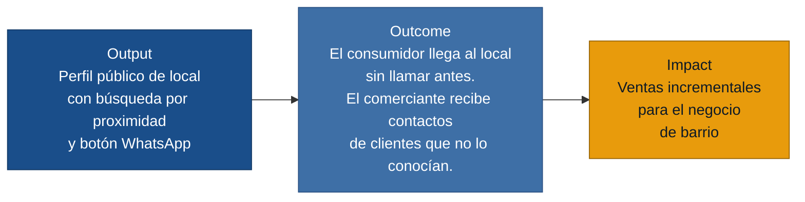

# MVP Canvas — Ubicate

---

| Bloque | Contenido |
|---|---|
| **Propuesta de valor** | Ubicate hace visibles a los negocios de barrio para quien busca un servicio cerca: el local aparece con información actualizada (horario real, servicios, contacto directo) y el consumidor llega sin llamar antes ni adivinar si está abierto. |
| **Segmento de usuarios** | **Oferta:** comerciantes de negocios de proximidad (tiendas, cafeterías, papelerías, comida rápida, servicios personales) que quieren ser encontrados sin gestionar redes sociales a diario. **Demanda:** consumidores en la misma zona que necesitan encontrar ese tipo de negocio y tomar una decisión sin llamar antes. |
| **Funcionalidades mínimas** | 1. Registro rápido del local: nombre, tipo de negocio, ubicación (manual o GPS), horario, lista de servicios y número WhatsApp (máx. 5 min, una pantalla). 2. Perfil público del local: horario, servicios, fotos, ubicación en mapa y botón de contacto WhatsApp. 3. Búsqueda por proximidad y por tipo de servicio o producto. |
| **Resultado esperado (outcome)** | El consumidor encuentra un local cercano con la información suficiente para ir o contactar sin llamar antes. El comerciante recibe al menos un contacto de cliente nuevo por WhatsApp que no lo conocía antes de Ubicate. |
| **Métrica de éxito** | 60% de los comerciantes activos reciben al menos 3 primeros contactos por WhatsApp de clientes nuevos en sus primeros 30 días en la plataforma. *(Prueba ácida: si este número sube, la decisión que cambia es expandir a nuevas zonas y evaluar monetización; si baja, hay que revisar la calidad de perfiles o la intención de búsqueda del consumidor.)* |
| **Riesgos / supuestos** | 1. El consumidor busca negocios locales activamente desde el teléfono (no espera que le lleguen). 2. El comerciante actualiza el perfil esporádicamente pero lo suficiente para no tener horarios vencidos. 3. El botón de WhatsApp tiene fricción suficientemente baja para que el consumidor lo use en lugar de seguir buscando. |
| **Fuera de alcance (por ahora)** | Sistema de turnos o reservas automáticas ("no necesariamente agenda automática al inicio" — entrevista_05_peluqueria.md). Reseñas y valoraciones ("no necesito reseñas ni puntuaciones todavía" — entrevista_06_consumidor_final.md). Panel de analítica para el comerciante. Integración con plataformas de delivery o pasarelas de pago. Notificaciones push. |

---

## Supuestos riesgosos (entrada para `/discovery:experiments`)

Los siguientes supuestos del MVP deben validarse antes de construir:

1. **Demanda activa del consumidor** — el consumidor busca deliberadamente negocios
   locales en el teléfono y no solo por recomendación boca a boca.
2. **Retención del comerciante** — el comerciante actualiza el perfil lo suficiente
   para que la información no quede desactualizada y genere desconfianza.
3. **Conversión del botón WhatsApp** — el botón de contacto es suficiente para que
   el consumidor escriba; no prefiere llamar o simplemente ir.
4. **Descubribilidad** — un consumidor que necesita imprimir, comer o cortarse el
   cabello piensa en buscar en Ubicate (o en un directorio local) en lugar de
   Google Maps o Instagram.
