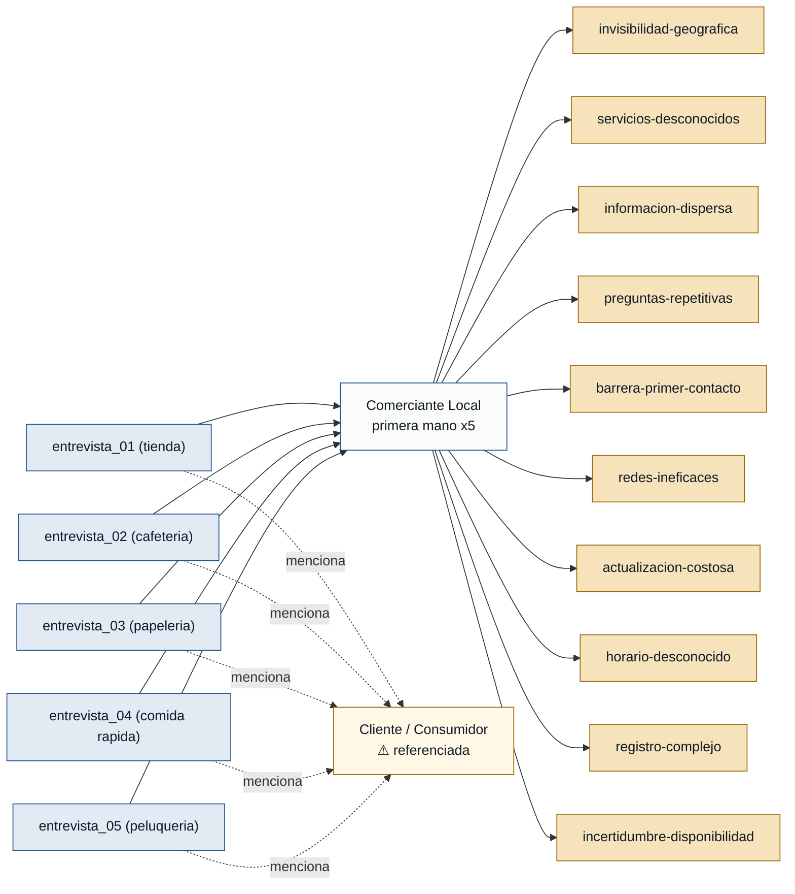

# Personas y Stakeholders — Ubicate

## Personas

### Comerciante Local — propietario o encargado de negocio de barrio

- **Contexto:** Dueño o encargado de un negocio de proximidad (tienda, cafetería, papelería, local de comida rápida, peluquería) que opera principalmente para clientes de su zona. Gestiona el local solo o con un equipo pequeño y usa WhatsApp como canal de comunicación principal.
- **Objetivo principal:** Ser encontrado por clientes nuevos que estén cerca, mostrar el catálogo completo de sus servicios y recibir contactos directos sin invertir tiempo diario en redes sociales.
- **Dolores:**
  - El local existe, pero clientes a pocas cuadras no saben que está ahí; solo llegan vecinos que ya lo conocen (entrevista_01_tienda_barrio.md, entrevista_02_cafeteria.md, entrevista_03_papeleria.md, entrevista_04_comida_rapida.md, entrevista_05_peluqueria.md).
  - Los clientes desconocen el catálogo completo de servicios: la tienda hace recargas y cobros; la papelería, anillados y plastificados; la peluquería, uñas y tintes (entrevista_01_tienda_barrio.md, entrevista_03_papeleria.md, entrevista_05_peluqueria.md).
  - No existe un lugar centralizado donde estén ordenados el horario, los servicios, los precios y las promociones (entrevista_02_cafeteria.md).
  - Los clientes preguntan repetidamente por WhatsApp datos que deberían estar visibles: precios, horario, delivery, métodos de pago (entrevista_01_tienda_barrio.md, entrevista_03_papeleria.md, entrevista_04_comida_rapida.md, entrevista_05_peluqueria.md).
  - Un cliente nuevo no tiene cómo contactar el negocio: no conoce el número de WhatsApp ni sabe qué se ofrece (entrevista_01_tienda_barrio.md, entrevista_05_peluqueria.md).
  - Las redes sociales no son un canal efectivo para nuevos clientes: los posts se pierden en el feed, el mantenimiento consume tiempo que no tienen y no todos los clientes revisan redes antes de salir (entrevista_02_cafeteria.md, entrevista_04_comida_rapida.md, entrevista_05_peluqueria.md).
  - Actualizar promociones o el menú en las herramientas actuales es lento; si toma demasiado tiempo, el comerciante deja de hacerlo (entrevista_02_cafeteria.md, entrevista_04_comida_rapida.md).
  - Negocios con horario atípico (tarde/noche) o en temporada baja tienen horas muertas que nadie conoce (entrevista_04_comida_rapida.md, entrevista_05_peluqueria.md).
  - Formularios de registro extensos son una barrera de adopción: el comerciante está atendiendo y no puede parar a llenar muchos campos (entrevista_03_papeleria.md).
- **Respaldo:** `primera mano` — 5 entrevistas de roles distintos del mismo tipo de actor: `dueno_de_tienda_de_barrio`, `administradora_de_cafeteria`, `encargado_de_papeleria`, `propietario_de_local_de_comida_rapida`, `encargada_de_peluqueria`.

---

### Cliente / Consumidor — persona que busca un negocio o servicio cercano

- **Contexto:** Persona que necesita un servicio o producto local (comida, copias, corte, recarga) y no tiene información sobre qué opciones tiene cerca o si el local de su preferencia está abierto en ese momento.
- **Objetivo principal:** Encontrar rápidamente un negocio cercano que ofrezca lo que necesita, con información suficiente para decidir ir sin tener que llamar ni escribir antes.
- **Dolores:**
  - No sabe qué negocios existen cerca ni qué servicios específicos ofrecen más allá del letrero (mencionado en entrevista_01_tienda_barrio.md, entrevista_02_cafeteria.md, entrevista_03_papeleria.md, entrevista_04_comida_rapida.md, entrevista_05_peluqueria.md).
  - Tiene que llamar o escribir por WhatsApp antes de ir para confirmar horario, precio o disponibilidad (mencionado en entrevista_01_tienda_barrio.md, entrevista_03_papeleria.md, entrevista_04_comida_rapida.md, entrevista_05_peluqueria.md).
  - Elige la primera opción visible, no necesariamente la que mejor se ajusta a su necesidad (mencionado en entrevista_02_cafeteria.md).
- **Respaldo:** `referenciada` — no existe entrevista de primera persona de este rol. Solo aparece mencionada por los comerciantes.

> **⚠️ Advertencia:** esta persona no tiene respaldo de primera mano. El gate de readiness bloqueará la generación del MVP Canvas y las user stories hasta que se realice al menos una entrevista directa con un consumidor final que valide sus dolores y comportamiento de búsqueda.

---

## Stakeholders

### Comerciante Local (como actor interesado en la plataforma)

- **Interés en el sistema:** Obtener visibilidad sostenida sin gestión diaria; que su información esté siempre disponible para clientes nuevos; que el primer contacto llegue sin fricción a través de WhatsApp.
- **Fuente:** entrevista_01_tienda_barrio.md, entrevista_02_cafeteria.md, entrevista_03_papeleria.md, entrevista_04_comida_rapida.md, entrevista_05_peluqueria.md.

> **Nota:** Las 5 entrevistas se centran exclusivamente en el lado de la oferta (comerciantes). No se identificó ningún otro stakeholder (inversores, plataformas de pago, municipio, etc.) porque las entrevistas no los mencionan. Añadir stakeholders sin evidencia violaría la regla de cero invención.

---

## Mapa de trazabilidad

