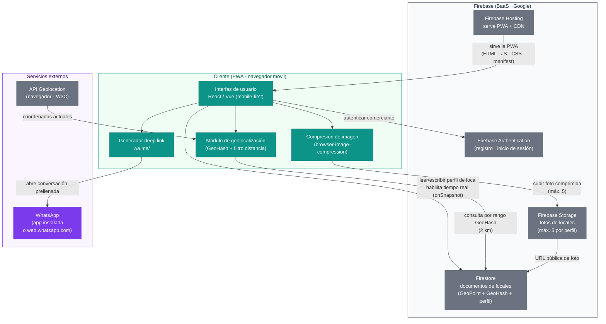

# Arquitectura — Ubicate MVP

> Generado por: Architect  
> Fecha: 2026-06-20  
> Delivery: ubicate

---

## Contexto y restricciones

Las siguientes fuerzas del inbox determinan la forma de la arquitectura. Cada una
cita su origen para garantizar trazabilidad.

| Fuerza | Origen | Implicación arquitectónica |
|---|---|---|
| Los comerciantes operan únicamente desde el teléfono; WhatsApp es su único canal actual | R-12, personas.md (5 entrevistas) | La plataforma debe ser mobile-first y no requerir instalación desde tienda |
| Registro en menos de 5 minutos, una sola pantalla | R-09, US-01 (E-01) | Cero fricción de onboarding; el BaaS gestiona autenticación sin código propio |
| Actualización de horario/promoción visible en menos de 2 minutos | R-10, US-03 (E-05) | Los datos del perfil deben propagarse en tiempo real al cliente del consumidor |
| Búsqueda por proximidad con radio fijo de 2 km | R-03, US-05 (E-02) | Se necesita almacenar GeoHash junto al GeoPoint del local en la base de datos |
| Botón WhatsApp con número prellenado y texto fijo | R-05, US-04, US-08 (E-04) | Deep link `wa.me/` sin API de pago; implementación sin dependencias externas |
| Máximo 5 fotos por perfil de local | R-07, US-07 (E-03) | Almacenamiento de objetos integrado; compresión en cliente antes de subir |
| Segmento informal de barrio, posible conectividad limitada | personas.md, contexto | PWA con caché de activos estáticos; compresión de fotos para ahorrar datos |
| Descubribilidad incierta (OQ-01) | mvp-canvas.md (supuesto riesgoso #4) | El perfil de cada local debe ser una URL pública indexable por buscadores |

---

## Decisiones tomadas (resumen)

| Dimensión | Decisión | ADR |
|---|---|---|
| Plataforma de entrega | Progressive Web App (PWA) accesible por URL, instalable en pantalla de inicio | ADR-0001 |
| Backend y persistencia | Firebase (Firestore + Authentication + Hosting) | ADR-0002 |
| Geolocalización y búsqueda por radio | GeoHash en Firestore + filtro de distancia en cliente | ADR-0003 |
| Integración WhatsApp | Deep link `https://wa.me/<numero>?text=<mensaje>` sin API de pago | ADR-0004 |
| Almacenamiento de fotos | Firebase Storage con compresión en cliente; límite de 5 fotos por perfil | ADR-0005 |

---

## Diagrama de componentes

**Leyenda:**
- Teal (`#0d9488`): componentes propios de Ubicate (código que el equipo escribe).
- Gris (`#6b7280`): servicios de terceros estándar sin costo especial de riesgo.
- Morado (`#7c3aed`): servicio externo de tercero con comportamiento fuera del control
  del equipo (Meta/WhatsApp puede cambiar el esquema `wa.me/` sin aviso).

---

## Lo que no está en el MVP (decisiones de no-hacer)

Las siguientes capacidades están fuera del alcance del MVP por decisión explícita del
MVP Canvas o porque el inbox no las respalda. Se registran para evitar que se
introduzcan durante el desarrollo.

| Capacidad excluida | Razón |
|---|---|
| Sistema de turnos o reservas automáticas | Explícitamente fuera de alcance en MVP Canvas ("no necesariamente agenda automática al inicio" — entrevista_05_peluqueria.md) |
| Reseñas y valoraciones | Explícitamente fuera de alcance en MVP Canvas ("no necesito reseñas ni puntuaciones todavía" — entrevista_06_consumidor_final.md) |
| Panel de analítica para el comerciante | Fuera de alcance en MVP Canvas; no hay historia ni requisito que lo respalde |
| Integración con pasarelas de pago o delivery | Fuera de alcance en MVP Canvas |
| Notificaciones push | Fuera de alcance en MVP Canvas; requeriría Service Worker adicional y validación de valor que no existe en el inbox |
| WhatsApp Business API | Costo por conversación y proceso de aprobación Meta incompatibles con el go-to-market rápido del MVP; ver ADR-0004 |
| Búsqueda full-text avanzada (Algolia) | No se justifica en el MVP; la búsqueda por texto libre sobre el campo de servicios funciona con búsqueda de texto en Firestore para el volumen del MVP |
| Modo offline con cola de sincronización | US-03 (criterio de aceptación) define explícitamente que no existe cola offline en esta versión |
| Gestión de múltiples sucursales por comerciante | No hay historia ni requisito en el inbox que lo mencione; el segmento es de locales únicos de barrio |
| App nativa (Google Play / App Store) | Descartado en ADR-0001; ciclos de revisión incompatibles con iteración rápida del MVP |

---

## Riesgos técnicos abiertos

Los siguientes puntos no tienen decisión definitiva en el MVP y deben monitorearse:

1. **Búsqueda full-text + geo combinada (OQ implícita de US-02 + US-05):** En el MVP,
   la búsqueda por texto libre sobre servicios y la búsqueda geoespacial se ejecutan
   como dos pasos separados o con Firestore `array-contains`. Si el volumen de locales
   crece, Firestore mostrará sus límites para combinar filtros full-text y geo en una
   sola consulta eficiente. Solución futura: Algolia con extensión de geo.

2. **Descubribilidad orgánica (OQ-01):** El MVP entrega perfiles como URLs indexables,
   pero no valida si el consumidor llegará desde Google. Si OQ-01 se resuelve con
   evidencia de que el consumidor solo usa apps dedicadas, habría que invertir en ASO
   o en presencia en tiendas de apps (reconsideración de ADR-0001).

3. **Disponibilidad de WhatsApp en comerciantes (OQ-05):** El deep link asume WhatsApp
   instalado. Si una proporción significativa de comerciantes no tiene WhatsApp activo
   o número válido, el botón de contacto queda deshabilitado (US-08 lo cubre: "el
   botón no aparece o está deshabilitado con mensaje explicativo"), pero el valor del
   producto se reduce. Validar antes de escalar.

4. **GPS no activado en teléfonos del segmento (OQ-03):** R-01 ya contempla entrada
   manual de ubicación como alternativa, pero la UX del flujo manual (mapa interactivo
   o texto de dirección) debe diseñarse con cuidado para no violar R-09 (menos de 5
   minutos de registro).

5. **Costos de Firebase Storage en crecimiento:** el plan gratuito (Spark) soporta el
   MVP, pero si el número de fotos crece debe evaluarse Cloudinary o S3 + CDN para
   control de costos y transformación de imágenes.
