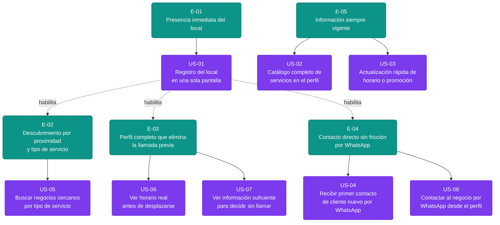

# Épicas — Ubicate

> Generado por: Product Owner  
> Fuente: `deliveries/ubicate/inbox/`  
> Fecha: 2026-06-20

---

## E-01 · Presencia inmediata del local

**Valor (outcome):** El comerciante que nunca ha tenido presencia digital queda visible en búsquedas locales en menos de 5 minutos desde su teléfono, eliminando la barrera de adopción más crítica.  
**Origen:** mvp-canvas (Funcionalidades mínimas #1) · R-01 · R-09 · R-12 · US-01 · pain `invisibilidad-geografica` · pain `registro-complejo`  
**Prioridad:** 1 — Es el prerrequisito absoluto: sin perfil registrado no existe ningún otro valor del producto.  
**Historias:** US-01

---

## E-02 · Descubrimiento por proximidad y tipo de servicio

**Valor (outcome):** El consumidor que no conoce el barrio o que busca un servicio específico encuentra opciones locales reales ordenadas por cercanía, sin depender de recomendaciones boca a boca ni de Google Maps.  
**Origen:** mvp-canvas (Funcionalidades mínimas #3) · R-03 · R-04 · US-05 · pain `invisibilidad-geografica` · pain `servicios-desconocidos`  
**Prioridad:** 2 — Sin búsqueda funcional el perfil registrado en E-01 nunca llega al consumidor; es el puente entre oferta y demanda.  
**Historias:** US-05

---

## E-03 · Perfil completo que elimina la llamada previa

**Valor (outcome):** El consumidor puede decidir si ir al local (horario, servicios, fotos, métodos de pago) sin llamar ni escribir antes; el comerciante deja de responder las mismas preguntas por WhatsApp.  
**Origen:** mvp-canvas (Funcionalidades mínimas #2) · R-02 · R-07 · R-08 · US-06 · US-07 · pain `preguntas-repetitivas` · pain `informacion-dispersa`  
**Prioridad:** 3 — Convierte la visibilidad conseguida en E-02 en una decisión real del consumidor; sin información suficiente el comerciante sigue perdiendo clientes.  
**Historias:** US-06, US-07

---

## E-04 · Contacto directo sin fricción por WhatsApp

**Valor (outcome):** El consumidor nuevo escribe al comerciante con un solo toque desde el perfil; el comerciante recibe el primer contacto de un cliente que no lo conocía, cumpliendo la métrica de éxito del MVP (≥ 3 contactos nuevos en 30 días).  
**Origen:** mvp-canvas (Resultado esperado · Métrica de éxito) · R-05 · US-04 · US-08 · pain `barrera-primer-contacto`  
**Prioridad:** 4 — Es la conversión final del funnel y la única métrica de éxito definida en el MVP Canvas; sin ella no hay forma de medir si el producto funciona.  
**Historias:** US-04, US-08

---

## E-05 · Información siempre vigente

**Valor (outcome):** El comerciante puede actualizar horario, promociones o menú del día en menos de 2 minutos desde el teléfono; el consumidor nunca llega a un local cerrado por confiar en datos viejos.  
**Origen:** mvp-canvas (Supuesto riesgoso #2 "Retención del comerciante") · R-06 · R-10 · R-11 · US-03 · pain `actualizacion-costosa` · pain `horario-fuera-pico-desconocido`  
**Prioridad:** 5 — Sostiene la calidad del ecosistema a largo plazo; su ausencia erosiona la confianza del consumidor y la retención del comerciante, pero requiere que E-01 a E-04 existan primero.  
**Historias:** US-02, US-03

---

## Preguntas abiertas (open questions)

Las siguientes cuestiones no tienen respaldo suficiente en el inbox y NO se convirtieron en épicas ni historias:

| # | Pregunta | Por qué no se incluyó |
|---|---|---|
| OQ-01 | ¿El consumidor busca activamente en una app dedicada o solo si aparece en resultados de búsqueda web? | El inbox marca esto como "supuesto riesgoso #4 (Descubribilidad)" sin evidencia de primera mano del consumidor. |
| OQ-02 | ¿Qué radio geográfico es "razonable" para la búsqueda por proximidad? | US-05 menciona "radio razonable" pero no hay dato numérico validado en ninguna entrevista. |
| OQ-03 | ¿El comerciante tiene teléfono con GPS activado y permisos de ubicación? | R-01 permite ubicación manual o GPS, pero no hay dato sobre prevalencia del uso de GPS en el segmento. |
| OQ-04 | ¿Existe un perfil de consumidor con entrevista de primera mano? | personas.md advierte explícitamente que el consumidor es "referenciada" sin entrevista directa. |
| OQ-05 | ¿Qué ocurre con negocios que no tienen número de WhatsApp activo? | R-05 asume WhatsApp disponible; no se registró ningún comerciante sin WhatsApp en el inbox. |

---

## Diagrama del backlog

> **Leyenda:** Teal = épica · Morado = historia candidata (pendiente de refinamiento Developer) · Verde = historia lista para sprint (ninguna en esta etapa; pasan al gate DoR/INVEST tras refinamiento).
